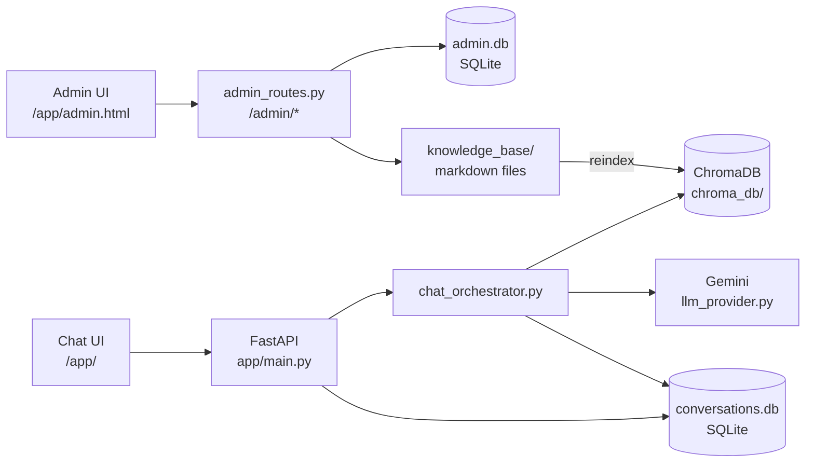
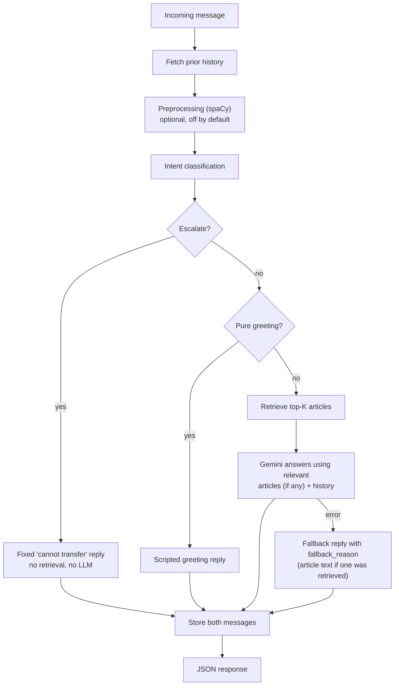

# SmartAssist — AI-Powered Customer Support Chatbot


A customer support chatbot that answers questions from a markdown knowledge
base using retrieval-augmented generation (RAG), keeps conversation history,
and hands off to a human when it should not keep answering on its own.

Built over 15 days as a **CODE-A-NOVA internship project**, following the
official project brief: NLP preprocessing → RAG retrieval → LLM response
generation → conversation memory → escalation logic, served through a web UI
with an admin panel.


Live At : https://smartassist-ai-powered-customer-support-chatbot-production.up.railway.app/app/


> **Project status:** the full pipeline is implemented and covered by
> automated tests that use fakes and mocks. It has **not** yet been run
> against a real Gemini API, real embeddings, a real ChromaDB index, a real
> browser, or a Docker image build, and it is **not** deployment-validated. A
> `Dockerfile` and `railway.json` are included (see
> [Docker and Railway](#docker-and-railway)), but their behavior was not
> verified here. See [Testing and evaluation](#testing-and-evaluation) and
> [Known limitations](#known-limitations).

---

## Table of contents

- [Overview](#overview)
- [Problem statement](#problem-statement)
- [Key features](#key-features)
- [Architecture](#architecture)
- [Knowledge base](#knowledge-base)
- [Technology stack](#technology-stack)
- [Project structure](#project-structure)
- [Getting started](#getting-started)
- [Usage](#usage)
- [Configuration](#configuration)
- [API reference](#api-reference)
- [Testing and evaluation](#testing-and-evaluation)
- [Security considerations](#security-considerations)
- [Known limitations](#known-limitations)
- [Future improvements](#future-improvements)
- [Contributing](#contributing)

---

## Overview

SmartAssist takes a customer message and runs it through a pipeline:

1. Classify the intent (greeting, FAQ, complaint, technical issue, escalation).
2. Decide whether the conversation should go to a human.
3. Otherwise, retrieve the most relevant knowledge base articles.
4. Ask an LLM (Google Gemini) to answer using those articles. Company-specific
   answers are limited to the articles; general questions get a brief answer.
5. Save both sides of the conversation in SQLite.

Customers use a browser chat interface and can rate each answer. Admins use a
separate, authenticated panel to manage knowledge base articles and review
conversation logs and feedback.

## Problem statement

Support teams answer the same questions repeatedly, while customers want
quick, accurate answers and a clear path to a person when the bot cannot
help. A useful support bot therefore needs to:

- ground answers in approved content instead of guessing,
- admit when it has no relevant information,
- remember earlier turns in a conversation,
- recognize when to stop and escalate to a human.

SmartAssist is a learning-scale implementation of that design.

## Key features

**Implemented**

- **RAG pipeline** — semantic search over 31 markdown FAQ articles using
  `all-MiniLM-L6-v2` embeddings and ChromaDB, with top-K retrieval and a
  relevance threshold.
- **LLM answer generation** — Gemini via a provider abstraction (the
  `google-genai` SDK), with a system prompt that limits company-specific
  answers to the retrieved help articles, allows brief answers to general
  questions, and treats retrieved text and user messages as data, not
  instructions. The LLM is called even when no article matches.
- **Intent classification** — rules first, embedding similarity as fallback;
  five intents plus `unknown`.
- **Escalation logic** — explicit human requests and a transparent
  rule-based frustration heuristic (not a sentiment model). Low intent
  confidence alone no longer escalates (see
  [Intent and escalation rules](#intent-and-escalation-rules)).
- **Conversation memory** — SQLite sessions and messages with a sliding
  window for context.
- **Web chat UI** — plain HTML/CSS/JavaScript, typing indicator, session
  persistence across reloads, thumbs up/down feedback per answer, a request
  timeout, and a guard against duplicate submissions while a request is
  running.
- **Admin panel** — token-protected KB article create/edit, index refresh,
  conversation logs, audit log, and feedback list.
- **Evaluation tooling** — reproducible intent, retrieval, escalation and
  feedback metrics that report "unavailable" instead of inventing numbers.
- **Safe degradation** — missing dependencies or a failed LLM call return a
  fallback reply rather than crashing the request. The response carries a
  machine-readable `fallback_reason`, and if a relevant article was retrieved
  its text is shown instead of a bare error.
- **Request timing** — stage durations (intent, retrieval, LLM wait, total,
  and so on) are returned in the `/chat` response and logged as structured
  lines that contain no message text.
- **Duplicate-request guard** — a second concurrent `/chat` request for the
  same session gets HTTP 429.
- **Docker and Railway configuration** — `Dockerfile`, `docker-compose.yml`
  and `railway.json` are included, with a build-time consistency check. They
  have not been built or deployed by the author of this documentation.

**Not implemented**

- A live human-agent handoff. There is no live-agent integration: the
  escalation reply tells the customer the chat cannot transfer them and that
  no one has been notified, and the API always returns
  `handoff_confirmed: false`.

## Architecture

### System components



### Chat workflow (`POST /chat`)



The pipeline lives in `app/chat_orchestrator.py`. The `/chat` route in
`app/main.py` is a thin wrapper around it.

### Design decisions

- **Escalation runs first and short-circuits.** An escalated message skips
  retrieval and the LLM and receives a fixed reply. The reply says the chat
  cannot transfer the customer to a person and that no one has been notified,
  because no live-agent integration exists. No AI answer is generated.
- **Preprocessing is not fed downstream.** Intent routing and retrieval do
  their own normalization, and the router's rule phrases (such as "how do i")
  depend on stop words that preprocessing removes. Because its output was
  unused, the spaCy step no longer runs per request unless
  `RUN_SPACY_PREPROCESSING` is enabled.
- **History is fetched before the current message is stored**, so the
  escalation check does not double-count the message being evaluated.
- **Each external boundary degrades on its own.** spaCy, the embedding model,
  ChromaDB and Gemini each fall back through that module's existing defensive
  behavior; a failure does not crash the request.
- **The LLM is asked even when no article matches.** Previously a miss
  returned a canned "no information" reply without calling the model. The
  prompt now tells the model not to invent company policy and to answer
  general questions briefly.
- **Only pure greetings get the scripted reply.** A message such as "Hello,
  how do I reset my password?" is treated as a real question.
- **One embedding per request.** Intent classification and retrieval share a
  per-request memo of the message embedding, which is discarded afterwards.
  The embeddings of the static intent example phrases are cached for the
  life of the process (only for the real embedder).
- **One in-flight `/chat` request per session** (in-memory, per process).
- **Bounded Gemini calls.** One request per message, a per-attempt timeout,
  and by default at most one retry (`LLM_MAX_RETRIES`), only for transient
  HTTP status codes, never on a timeout, and only if the total time budget
  allows. See [Configuration](#configuration).

### Intent and escalation rules

- **Intents:** `greeting`, `faq`, `complaint`, `technical_issue`,
  `escalation`, and `unknown`. Rules are checked in a fixed priority order
  (escalation → complaint → technical_issue → greeting → faq).
- **Confidence:** a rule match uses a fixed `0.95`. A semantic match uses the
  actual cosine similarity and is accepted only at `0.55` or above;
  otherwise the result is `unknown`.
- **Escalation triggers:** an explicit human request, or frustration
  detected (including repeated failure across turns). Intent confidence
  below `0.6` no longer escalates by itself; it only counts together with
  frustration, which is reported as `multiple_escalation_signals`. Setting
  `ESCALATE_ON_LOW_CONFIDENCE=true` restores the old behavior of escalating
  on low confidence alone.
- **Why low confidence stopped escalating:** a message that matches no rule
  phrase falls through to the embedding fallback, and below `0.55` similarity
  (or when the embedding model is unavailable, confidence `0.0`) it is
  labeled `unknown`. Under the old rule that alone escalated ordinary
  questions before retrieval or the LLM ran. This explanation comes from the
  project's own notes (`docs/PERFORMANCE_AND_FIXES.md`) and the code; it was
  not reproduced against a live deployment here.
- **Escalation replies:** an explicit human request and a frustration
  escalation each get a fixed reply stating that the chat cannot transfer the
  customer and that no one has been notified.
- **Frustration heuristic:** counts matched categories (negative language,
  failure language, urgency, repeated punctuation). At least two categories
  are needed to reach the `0.4` threshold, so a single keyword does not
  escalate. It cannot detect frustration that uses none of these signals,
  such as dry sarcasm.

## Knowledge base

- 31 markdown articles in `knowledge_base/`, organized into six categories:
  `account`, `billing`, `technical`, `shipping`, `returns`, `general`.
- Each article has frontmatter (`id`, `category`, `title`) and a body. The
  articles were generated once by `scripts/generate_kb.py`. In the latest ZIP,
  `general/how-do-i-contact-a-human-agent.md` has malformed frontmatter (see
  [Known limitations](#known-limitations)).
- `app/knowledge_base_loader.py` parses the files and skips unreadable ones
  instead of failing the whole load.
- `scripts/build_index.py` embeds the articles with `all-MiniLM-L6-v2` and
  stores them in ChromaDB (`chroma_db/`) with title, category, filename and
  path metadata, so answers can be traced to their source article.
- Retrieval returns the top K (default 3) results, each tagged
  `is_relevant` by comparing its distance to `RELEVANCE_DISTANCE_THRESHOLD`.
  That threshold is a starting guess and has not been tuned on real data.
- The LLM prompt includes at most 2 articles of up to 700 characters each.
- Admins can add or edit articles in the admin panel; the vector index is
  rebuilt after each change.

## Technology stack

| Area | Technology |
|---|---|
| Backend | Python, FastAPI, Uvicorn |
| NLP preprocessing | spaCy (`en_core_web_sm`), optional: listed in `requirements-dev.txt`, not in `requirements.txt` |
| Embeddings | sentence-transformers (`all-MiniLM-L6-v2`) |
| Vector store | ChromaDB (persistent, local) |
| LLM | Google Gemini via the `google-genai` SDK (default model `gemini-2.5-flash`, set with `GEMINI_MODEL`), behind a provider abstraction |
| Storage | SQLite (`conversations.db`, `admin.db`) |
| Frontend | HTML, CSS, JavaScript (no framework, no build step) |
| Deployment config | `Dockerfile`, `docker-compose.yml`, `railway.json` |
| Tests | Plain Python test modules, run with `python -m`; one Node.js script for frontend behavior |

## Project structure

```text
smartassist/
├── app/                      # backend application
│   ├── main.py               # FastAPI app and customer-facing routes
│   ├── chat_orchestrator.py  # end-to-end /chat pipeline
│   ├── preprocessing.py      # spaCy tokenization and lemmatization
│   ├── config.py             # central config and thresholds
│   ├── knowledge_base_loader.py
│   ├── embeddings.py         # all-MiniLM-L6-v2 wrapper
│   ├── vector_store.py       # ChromaDB indexing
│   ├── retrieval.py          # top-K search + relevance filtering
│   ├── llm_provider.py       # LLM abstraction + Gemini provider
│   ├── response_generator.py # prompt building + fallbacks
│   ├── intent_router.py      # rules + embedding-similarity intents
│   ├── escalation.py         # confidence and frustration escalation
│   ├── inflight.py           # one in-flight /chat request per session
│   ├── timing.py             # per-request stage timing and logs
│   ├── conversation_memory.py
│   ├── conversation_context.py
│   ├── feedback.py
│   ├── admin_store.py        # admin sessions + audit log
│   ├── admin_auth.py         # credential verification
│   ├── admin_dependencies.py # require_admin (Bearer token)
│   ├── admin_routes.py       # /admin/* routes
│   ├── admin_service.py      # KB edits + index refresh
│   ├── kb_admin.py           # safe article create/edit
│   ├── evaluation.py         # retrieval evaluation (sample queries)
│   ├── evaluation_data.py
│   ├── evaluation_metrics.py
│   ├── evaluation_runner.py
│   └── evaluation_report.py
├── frontend/                 # served by FastAPI at /app
│   ├── index.html
│   ├── style.css
│   ├── app.js
│   ├── admin.html
│   ├── admin.css
│   └── admin.js
├── knowledge_base/           # 31 articles in 6 category folders
│   ├── account/
│   ├── billing/
│   ├── technical/
│   ├── shipping/
│   ├── returns/
│   └── general/
├── scripts/
│   ├── generate_kb.py
│   ├── build_index.py
│   ├── evaluate_retrieval.py
│   ├── generate_admin_password_hash.py
│   ├── run_evaluation.py
│   ├── check_response_contract.py  # deployment consistency check
│   ├── smoke_test_gemini.py        # optional, real Gemini calls
│   ├── benchmark_pipeline.py       # local cost per request, with fakes
│   └── measure_live_latency.py     # client-side latency of a running app
├── tests/                    # 23 test modules + frontend_behavior.js (listed below)
├── docs/                     # architecture, demo guide, deployment, fixes
├── reports/                  # evaluation and testing reports
├── .env.example              # placeholders only, no real secrets
├── requirements.txt
├── requirements-dev.txt      # optional: spaCy, httpx, pytest
├── Dockerfile
├── docker-compose.yml
├── .dockerignore
├── railway.json
├── RAILWAY_UPDATE_STEPS.md   # GitHub + Railway update steps (Android)
├── .gitignore
└── README.md
```

Created automatically at runtime and gitignored: `conversations.db`,
`admin.db`, `chroma_db/`. The two `.db` files can be moved with `DATA_DIR`
(see [Configuration](#configuration)).

<details>
<summary>Test modules</summary>

```text
tests/
├── test_preprocessing.py
├── test_knowledge_base_loader.py
├── test_vector_store_logic.py
├── test_retrieval_logic.py
├── test_evaluation_logic.py
├── test_llm_provider.py
├── test_response_generator.py
├── test_intent_router.py
├── test_conversation_memory.py
├── test_escalation.py
├── test_frontend.py
├── test_admin.py
├── test_feedback.py
├── test_evaluation_metrics.py
├── test_response_generator_hardening.py
├── test_knowledge_base_edge_cases.py
├── test_retrieval_edge_cases.py
├── test_integration_flows.py
├── test_llm_provider_mocking.py
├── test_chat_orchestrator.py
├── test_docker_config.py
├── test_fallback_reason_regression.py
├── test_smartassist_fixes.py
└── frontend_behavior.js          # run with Node.js, not python -m
```

</details>

## Getting started

### Prerequisites

- A recent Python 3 release (no version is pinned in the project docs)
- Internet access for the first run: the `all-MiniLM-L6-v2` model
  (about 80 MB) is downloaded once (the spaCy model too, if you install the
  optional spaCy dependencies)
- A free Gemini API key from
  [Google AI Studio](https://aistudio.google.com/app/apikey) for real answers

### Install

Run these from the project root:

```bash
python -m venv venv
source venv/bin/activate        # Windows: venv\Scripts\activate
pip install -r requirements.txt
```

Optional: spaCy preprocessing and its tests, plus `httpx` and `pytest`:

```bash
pip install -r requirements-dev.txt
python -m spacy download en_core_web_sm
```

### Build the knowledge base index

```bash
python -m scripts.build_index
```

This creates `chroma_db/`. After editing articles by hand, rebuild with
`python -m scripts.build_index --force`.

### Configure

```bash
cp .env.example .env            # Windows: copy .env.example .env
```

Then edit `.env`. See [Configuration](#configuration) for each variable.
Never commit `.env`; it is already in `.gitignore`.

### Run

```bash
uvicorn app.main:app --reload
```

| URL | What it is |
|---|---|
| `http://127.0.0.1:8000/app/` | Customer chat UI |
| `http://127.0.0.1:8000/app/admin.html` | Admin panel |
| `http://127.0.0.1:8000/docs` | Interactive API docs |

### Docker and Railway

These files exist in the project. None of the behavior below was built, run
or deployed by the author of this documentation (Docker and Railway were not
available); `tests/test_docker_config.py` only checks the files statically,
and `reports/day15_docker_notes.md` records the same limitation for the
earlier Docker work.

- **`Dockerfile`** (`python:3.11-slim`): installs CPU-only PyTorch from the
  PyTorch CPU index, then `requirements.txt`; copies the project; runs
  `python -m scripts.check_response_contract` (a failure fails the build);
  then tries to pre-download the embedding model and run
  `python -m scripts.build_index`. That last step is non-fatal: if it fails
  the build continues with a warning. The container listens on `${PORT:-8000}`
  with one worker and defines a `HEALTHCHECK` on `/`.
- **`railway.json`**: Dockerfile builder, health check path `/` with a
  300-second timeout, restart on failure (at most 3 retries).
- **`docker-compose.yml`**: `cp .env.example .env`, fill in values, then
  `docker compose up --build` (its own header notes it was not run).
- **Railway variables** (from `RAILWAY_UPDATE_STEPS.md`): set
  `GEMINI_API_KEY`, `ADMIN_USERNAME` and `ADMIN_PASSWORD_HASH` in the
  service's Variables tab; optionally `GEMINI_MODEL`. Do not set `PORT`;
  Railway provides it. Railway containers lose local files on redeploy, so to
  keep the SQLite files, add a Volume (for example at `/data`) and set
  `DATA_DIR=/data`.
- **Updating from a phone:** `RAILWAY_UPDATE_STEPS.md` lists the steps. It
  asks you to upload all of `app/` every time, so files from different
  revisions are never mixed (see
  [Regression: `fallback_reason` crash](#regression-fallback_reason-crash)).
- **After a redeploy**, `RAILWAY_UPDATE_STEPS.md` suggests testing the live
  app, and says only then can anything be called fixed. The status of the
  live deployment was not checked for this README.

## Usage

### Chat

Open the chat UI and send a message. The browser stores the session id in
`localStorage`, so the conversation survives a page reload. Each assistant
reply has thumbs up/down buttons.

### Admin panel

1. Generate a password hash and put it in `.env` as `ADMIN_PASSWORD_HASH`:

   ```bash
   python -m scripts.generate_admin_password_hash
   ```

2. Restart the server and sign in at `/app/admin.html`.
3. From the panel you can view, add and edit articles, refresh the RAG
   index, and review conversation logs, the audit log, and feedback.

### API example

```bash
curl -X POST http://127.0.0.1:8000/chat \
  -H "Content-Type: application/json" \
  -d '{"message": "How do I reset my password?"}'
```

Reuse the returned `session_id` in later requests to continue the same
conversation.

## Configuration

### Environment variables

| Variable | Required | Purpose |
|---|---|---|
| `GEMINI_API_KEY` | For LLM answers | Gemini API key. Without it the LLM call fails and the safe fallback reply is returned (`fallback_reason: missing_api_key`). |
| `ADMIN_USERNAME` | No | Admin login name. Defaults to `admin`. |
| `ADMIN_PASSWORD_HASH` | For admin access | SHA-256 hash of the admin password. If unset, admin login always fails. |
| `GEMINI_MODEL` | No | Gemini model name. Default `gemini-2.5-flash`. |
| `LLM_TIMEOUT_SECONDS` | No | Per-attempt Gemini timeout. Default `12`. |
| `LLM_MAX_OUTPUT_TOKENS` | No | Maximum output tokens per answer. Default `400`. |
| `DATA_DIR` | No | Folder for `conversations.db` and `admin.db`. Defaults to the project root. |
| `PERF_LOGGING` | No | Set to `false` to turn off the structured timing logs. Default on. |

Use `.env.example` as the template. It contains placeholders only, never real
secrets; the five optional variables above appear in it as comments. `PORT` is
provided by Railway and read by the `Dockerfile`.

Further optional variables are read by `app/config.py` but are not listed in
`.env.example`:

| Variable | Default | Purpose |
|---|---|---|
| `LLM_MAX_RETRIES` | `1` | Extra Gemini attempts after a transient error (never after a timeout). |
| `LLM_RETRY_BACKOFF_SECONDS` | `0.4` | Pause before a retry. |
| `LLM_TOTAL_BUDGET_SECONDS` | `15` | Time budget that limits whether a retry is attempted. |
| `LLM_TEMPERATURE` | `0.3` | Gemini sampling temperature. |
| `GEMINI_THINKING_BUDGET` | `0` | Thinking budget; `0` turns thinking off. Applied only when the model name contains `2.5-flash`. |
| `ESCALATE_ON_LOW_CONFIDENCE` | off | `true` restores escalation on low intent confidence alone. |
| `RUN_SPACY_PREPROCESSING` | off | `true` runs the optional spaCy step on each request. |
| `WARMUP_ON_STARTUP` | on | `false` disables the background warm-up thread (see Known limitations). |

### Tunable settings (`app/config.py`)

These are starting defaults, not values tuned on real usage.

| Setting | Default | Purpose |
|---|---|---|
| `RULE_MATCH_CONFIDENCE` | 0.95 | Confidence assigned to a rule-based intent match |
| `SEMANTIC_CONFIDENCE_THRESHOLD` | 0.55 | Minimum similarity to accept a semantic intent match |
| `INTENT_ESCALATION_THRESHOLD` | 0.6 | Intent confidence below this counts as a low-confidence signal (it escalates alone only if `ESCALATE_ON_LOW_CONFIDENCE` is on) |
| `FRUSTRATION_SCORE_THRESHOLD` | 0.4 | Frustration score needed to escalate |
| `CONVERSATION_HISTORY_LIMIT` | 10 | Messages returned by the sliding window |
| `MAX_CONTEXT_ARTICLES` | 2 | Articles included in the LLM prompt |
| `MAX_CHARS_PER_ARTICLE` | 700 | Characters per article in the prompt |
| `MAX_FEEDBACK_COMMENT_CHARS` | 500 | Maximum feedback comment length |

`RELEVANCE_DISTANCE_THRESHOLD` (retrieval relevance cutoff),
`MAX_ARTICLE_TITLE_LENGTH` and `MAX_ARTICLE_CONTENT_CHARS` are also in
`app/config.py`. The prompt includes at most
`MAX_HISTORY_MESSAGES_IN_PROMPT` (4) prior messages.

## API reference

### Customer endpoints

| Method | Path | Description |
|---|---|---|
| GET | `/` | Status endpoint |
| POST | `/chat` | Send a message and get a reply |
| GET | `/history?session_id=...&limit=...` | Recent messages for a session |
| POST | `/feedback` | Rate an assistant reply |
| GET | `/app/` | Static frontend (chat UI and admin page) |

Every response carries an `X-Process-Time-Ms` header (total backend time for
that request).

#### `POST /chat`

Request (`session_id` is optional; omit it to start a new conversation):

```json
{ "message": "How do I reset my password?", "session_id": "optional" }
```

Response shape (values are illustrative):

```json
{
  "reply": "...",
  "session_id": "...",
  "message_id": 42,
  "intent": "faq",
  "intent_confidence": 0.95,
  "escalated": false,
  "escalation_reason": null,
  "articles_used": ["account-002"],
  "used_llm": true,
  "handoff_confirmed": false,
  "fallback_reason": null,
  "timings_ms": { "intent": 0.4, "retrieval": 12.0, "llm": 900.0, "total": 930.0, "llm_wait": 900.0, "local": 30.0 }
}
```

The last three fields are additive. `handoff_confirmed` is always `false`
because there is no live-agent integration. `used_llm` is `true` only when the
model's answer is what the customer received. `fallback_reason` is `null`
unless the LLM was not used for the answer; the values in the code are
`missing_api_key`, `llm_timeout`, `llm_rate_limited`, `llm_error`,
`llm_empty` and `empty_query`. `timings_ms` lists the stages that ran
(`preprocess`, `history`, `intent`, `escalation`, `retrieval`, `llm`,
`persist`) plus `total`, `llm_wait` and `local` (`total` minus the Gemini
wait); the numbers above are illustrative. The response also sets a
`Server-Timing` header with `total`, `local` and `llm` durations.

If a `session_id` is sent while another `/chat` request for that session is
still running, the server returns HTTP 429.

#### `GET /history`

Returns recent messages for the session, each with `id`, `role`, `content`
and `timestamp`. `limit` defaults to `CONVERSATION_HISTORY_LIMIT`. An unknown
`session_id` returns an empty list, not an error. The window limits what is
returned; it does not delete stored messages.

#### `POST /feedback`

```json
{ "session_id": "...", "message_id": 42, "rating": "helpful", "comment": "optional" }
```

`rating` must be `helpful` or `not_helpful`. The server checks that the
message exists, belongs to that session, and is an assistant message.
Re-rating the same message updates the existing row. A successful response
looks like `{ "status": "success", "feedback_id": 7, "updated": false }`.

### Admin endpoints

Every admin route except login requires `Authorization: Bearer <token>`.

| Method | Path | Description |
|---|---|---|
| POST | `/admin/login` | Exchange credentials for a session token |
| GET | `/admin/logs` | Audit log entries |
| GET | `/admin/feedback` | Raw feedback list |

`app/admin_routes.py` also defines the routes the panel uses to list, create
and edit articles and to refresh the index. Check that file or `/docs` for
their exact paths.

## Testing and evaluation

Automated tests and evaluation numbers below come from the project's own
reports, produced in a sandbox without spaCy, sentence-transformers,
ChromaDB, FastAPI, a browser, or Gemini credentials. They are **not**
real-world results. The "Observed" results below were produced while
preparing this README update, in a similar sandbox (no FastAPI, pytest,
spaCy, ChromaDB, sentence-transformers or Gemini key).

### Automated tests

Each suite is a module run from the project root:

```bash
python -m tests.test_chat_orchestrator
python -m tests.test_escalation
python -m tests.test_conversation_memory
python -m tests.test_fallback_reason_regression
python -m tests.test_smartassist_fixes
node tests/frontend_behavior.js
python -m scripts.check_response_contract
```

Several older suites print an `ALL ... PASSED` (or `N TEST(S) FAILED`) summary
but exit with code 0 either way, so read the summary line instead of the exit
code. `test_evaluation_metrics`, `test_llm_provider_mocking`,
`test_smartassist_fixes` and `test_fallback_reason_regression` exit non-zero on
failure. `test_preprocessing` needs spaCy and cannot run without it.

| Result | Detail |
|---|---|
| 407 checks passed, 0 failed | Across 18 executable suites at the end of Day 14. `test_preprocessing` was skipped because spaCy was unavailable. |
| 48 checks (`test_chat_orchestrator`) | End-to-end pipeline integration, run directly against `handle_chat_message()`. The earlier suites were re-run and still passed. |
| 118 checks (`test_evaluation_metrics`) | Metric math against hand-computed values. 26 deliberately injected bugs were all detected (mutation testing). |
| Observed: 21 of 23 modules passed | `test_knowledge_base_loader` reported 1 failure (malformed frontmatter in one KB article, see Known limitations). `test_preprocessing` could not run (spaCy not installed). |
| Observed: `test_fallback_reason_regression` | 8 of 8 tests passed. |
| Observed: `test_smartassist_fixes` | Passed. Gemini is mocked. |
| Observed: `tests/frontend_behavior.js` | All checks passed under Node.js against a fake DOM and fake `fetch` (no browser). |
| Observed: `scripts.check_response_contract` | Printed `OK`. |

Testing also found and fixed four real bugs (details in
`reports/day14_testing_report.md`):

- an exception outside the expected LLM error types crashed response
  generation;
- an empty or non-string provider reply was passed through as valid;
- `generate_response(query, None)` raised `TypeError`;
- one corrupted file in `knowledge_base/` made the whole load return zero
  articles.

#### Regression: `fallback_reason` crash

A production traceback recorded in `tests/test_fallback_reason_regression.py`
shows `AttributeError: 'GeneratedResponse' object has no attribute
'fallback_reason'` raised in `app/chat_orchestrator.py`. The project's notes
(the docstring of `scripts/check_response_contract.py` and
`RAILWAY_UPDATE_STEPS.md`) attribute this to files from different revisions
being deployed together, for example a newer `chat_orchestrator.py` next to an
older `response_generator.py`. That explanation was **not** conclusively
verified here, because the deployed image was not inspected.

Three checks guard against that class of mismatch:

- `tests/test_fallback_reason_regression.py` runs the real `generate_response()`
  and the real pipeline (only the LLM provider, embedder and vector collection
  are fakes). It checks that every attribute the orchestrator reads exists on
  `GeneratedResponse`, that `ChatResult` carries every field `main.py` reads,
  that the normal and fallback paths do not crash, and that each
  `fallback_reason` survives the full pipeline.
- `scripts/check_response_contract.py` reads the source of
  `app/chat_orchestrator.py` and `app/main.py` with `ast` and verifies that the
  attributes they read from `generated` and `result` exist on `GeneratedResponse`
  and `ChatResult`. It exits `0` when consistent and `1` otherwise.
- The `Dockerfile` runs that script after copying the project, so a mismatch
  fails the image build instead of shipping. That build step has not been run.

These checks compare attribute names only. They do not catch other drift: for
example, `app/main.py` imports `ensure_index_built` from `app/vector_store.py`,
which does not define it, and `scripts.check_response_contract` still prints `OK`.

#### Mocked tests versus real Gemini

All automated Gemini tests are mocked. `test_smartassist_fixes` covers mocked
success, missing credentials, timeouts and API errors, and `used_llm`
accuracy. `test_llm_provider_mocking` injects a fake `google.genai` module.
None of this proves the real Gemini API works with your key and model.

The only real-API check is the optional script below. It makes real network
calls and uses your quota, so it is never run by the test suite:

```bash
export GEMINI_API_KEY=...
python -m scripts.smoke_test_gemini
GEMINI_MODEL=gemini-2.5-flash-lite python -m scripts.smoke_test_gemini   # compare models
```

Without a key it prints `SKIPPED` and exits `1` (observed). No result from a
real run is recorded in this repository.

**What these tests do not prove**

- LLM tests use a fake provider, or a fake `google.genai` module injected
  through `sys.modules`. No real Gemini call has been made by the test suite.
- Retrieval tests use fake embeddings and a fake vector store.
- FastAPI was not installed, so tests call the same functions the routes
  use rather than sending HTTP requests. Routing and request validation are
  untested.
- No real browser has loaded the frontend. Its JavaScript was syntax-checked
  with `node --check`, inspected with static checks, and executed against a
  minimal fake DOM in Node (`tests/frontend_behavior.js`). That does not cover
  layout or rendering on a real Android phone.
- No test builds the Docker image or contacts Railway.
- No test coverage percentage is reported.

### Evaluation

```bash
python -m scripts.build_index
python -m scripts.run_evaluation     # writes reports/evaluation_report.md and .json
```

The evaluation uses small hand-written datasets: 52 labeled intent
messages, 12 retrieval queries (scored by category), and 20 synthetic
escalation scenarios with fixed intent confidences. Anything that cannot be
measured is labeled `UNAVAILABLE` or `NO DATA` rather than shown as zero.

The report shipped in `reports/` is **incomplete** and was generated before
the Day 15 integration, so it describes components only:

| Component | Result | Status |
|---|---|---|
| Intent | 43/52 correct (82.7%), rule layer only. All 9 misses were `unknown`; when a rule fired it was correct 43/43 times. | Partial: embedding fallback unavailable |
| Retrieval | No numbers | Unavailable: ChromaDB and embeddings not installed |
| Escalation | 17/20 correct decisions, 0 false escalations, 3 missed | Measured on synthetic scenarios |
| Feedback | No numbers | No data |

The 3 missed escalations were hard cases: a paraphrase not in the phrase
list ("Is there a live person I can chat with?") and two messages with
implicit frustration and no keyword signals. Regenerate the report on a
machine with all dependencies installed before citing these numbers.

End-to-end answer quality, hallucination rate and latency (the brief's target
is under 5 seconds for 90% of queries) have **not** been measured.

Two scripts exist for latency, neither measured against real services here.
`python -m scripts.benchmark_pipeline` measures local cost per request with
fakes (wall time, embedding calls, ChromaDB client opens, LLM calls), not real
model inference or Gemini time. `python -m scripts.measure_live_latency <url>`
sends a few questions to a running instance and prints client-side and
server-side timings. The deployed app also logs one `chat_timing` JSON line per
request.

## Security considerations

- **SQL:** all queries are parameterized. Roles are validated against an
  allow-list, and empty messages are rejected.
- **Secrets:** the Gemini key and admin hash live only in `.env`, which is
  gitignored (or in your host's variables, such as Railway's Variables tab).
  Neither appears in the frontend code, and the audit log stores only action
  names, article ids and status strings.
- **Timing logs:** they hold stage names, durations and a few non-sensitive
  flags (intent name, `used_llm`, `fallback_reason`, article count), never
  message text or keys.
- **Admin access:** login credentials come from environment variables, and
  login fails closed if no hash is configured. Sessions are random tokens
  stored server-side in `admin.db`, checked by `require_admin` on every admin
  route.
- **Path traversal:** KB categories and filenames must match
  `^[a-z0-9][a-z0-9-]*$`, and each resolved path is re-checked with
  `os.path.realpath()` to confirm it stays inside `knowledge_base/`.
- **Input limits:** article title and content, and feedback comments, have
  length limits.
- **Frontend:** message content is rendered with `textContent`, not
  `innerHTML`. Admin tokens use `sessionStorage`; the customer session id uses
  `localStorage`.
- **Feedback integrity:** message and session ownership are verified
  server-side on every submission.
- **Prompt injection:** the system prompt tells the model to treat retrieved
  articles, history and user messages as data, and the prompt separates them
  with delimiters. This is a mitigation tested only with fakes; it has not
  been verified against a real model.

Known gaps are listed under [Known limitations](#known-limitations).

## Known limitations

- Never exercised against a real Gemini API, real embeddings, or a real
  ChromaDB index; only fakes and mocks. Set a real `GEMINI_API_KEY`, run
  `scripts/build_index.py`, and test real conversations before treating the
  system as validated.
- No real browser testing, and no live-server HTTP test.
- The Docker image has not been built and the Railway deployment has not been
  verified (see [Docker and Railway](#docker-and-railway)). The project is not
  production-ready.
- Preprocessing output is not used by intent routing or retrieval, and the
  spaCy step is off unless `RUN_SPACY_PREPROCESSING` is enabled.
- `preprocessing_available` (an internal result field, not in the API
  response) is `False` unless that step is enabled and spaCy is installed.
- There is no live-agent handoff. Escalation replies say so.
- Startup warm-up: `app/main.py` imports `ensure_index_built` from
  `app/vector_store.py`, but that function is not defined there, so the
  warm-up thread's import fails and (per the code) it logs
  `{"event": "warmup_failed"}`. The warm-up and index self-heal described in
  `docs/PERFORMANCE_AND_FIXES.md`, and the `warmup_done` log line expected by
  `RAILWAY_UPDATE_STEPS.md`, therefore do not run in this revision. The vector
  index is otherwise built only by `scripts/build_index.py` (including the
  non-fatal Docker build step). This was confirmed by importing the name; the
  warm-up itself was not run.
- The ChromaDB collection handle is not cached: `get_collection()` opens a
  client on each retrieval. `scripts.benchmark_pipeline` (fake ChromaDB)
  reports one open per request, which differs from the "once per process"
  statement in `docs/PERFORMANCE_AND_FIXES.md`.
- `knowledge_base/general/how-do-i-contact-a-human-agent.md` has no `---`
  frontmatter delimiters and its fields are on one line. The loader cannot
  parse its title, and `tests.test_knowledge_base_loader` reports that
  failure.
- Thresholds (`RELEVANCE_DISTANCE_THRESHOLD`, `SEMANTIC_CONFIDENCE_THRESHOLD`,
  `INTENT_ESCALATION_THRESHOLD`, `FRUSTRATION_SCORE_THRESHOLD`) are untuned
  starting values.
- Keyword and phrase lists for intents and frustration are starter sets.
  Paraphrased human requests and implicit frustration can be missed.
- The router can label a message `escalation`, but the escalation check only
  uses its own phrase list and ignores that label.
- The admin password is stored as a SHA-256 hash, a general-purpose hash
  rather than a dedicated password-hashing algorithm.
- LLM responses are not cached. The intent example phrases are embedded once
  per process for the real embedder; the effect on real latency is not
  measured.
- Evaluation datasets are small and hand-written, and the shipped report is
  partial.
- Conversation history stays in `conversations.db` until the file is deleted.
  On Railway without a Volume, local files are lost on every redeploy. `DATA_DIR`
  moves only the two SQLite files; `chroma_db/` and `knowledge_base/` stay under
  the project root, so admin-panel article edits are not stored under `DATA_DIR`.
- The default model `gemini-2.5-flash` and the `google-genai` calls have not
  been checked against the live API from this project's tests. Google retires
  models over time (the earlier default, `gemini-1.5-flash`, is described in
  `app/config.py` as retired), so confirm the configured model is available for
  your key, for example with `scripts/smoke_test_gemini.py`.

## Future improvements

- Build and run the Docker image locally and verify the Railway deployment end
  to end; the files exist but have not been verified.
- Run the full evaluation locally and regenerate the report; use it to tune
  thresholds, and only after that adjust rules.
- Treat an `escalation` intent at sufficient confidence as an explicit
  request (candidate fix; changes escalation behavior, so verify first).
- Re-measure and carefully extend the frustration heuristic for implicit
  signals, watching for false escalations.
- Measure real latency (Gemini, embeddings, ChromaDB) against the brief's
  target with the existing scripts, then decide what else to cache.
- Evaluate the integrated pipeline end to end, including answer quality and
  hallucination avoidance.
- Review "not helpful" feedback to find knowledge base gaps once real users
  rate responses.
- Consider a dedicated password-hashing algorithm for admin credentials
  (suggestion, not part of the original roadmap).
- Add FastAPI route tests; `httpx` and `pytest` are already listed in
  `requirements-dev.txt` (suggestion).

## Contributing

Contributions and suggestions are welcome.

1. Fork the repository and create a feature branch.
2. Keep changes focused, and add or update tests under `tests/`.
3. Run the relevant suites with `python -m tests.<module_name>`, plus the
   suites for any module you touched.
4. State clearly in your pull request whether a test used real services or
   fakes.
   If you change `GeneratedResponse`, `ChatResult` or the code that reads them,
   also run `python -m tests.test_fallback_reason_regression` and
   `python -m scripts.check_response_contract`.
5. Never commit `.env`, API keys, password hashes, or the runtime databases.
6. Keep documentation accurate: do not describe planned work as implemented.
