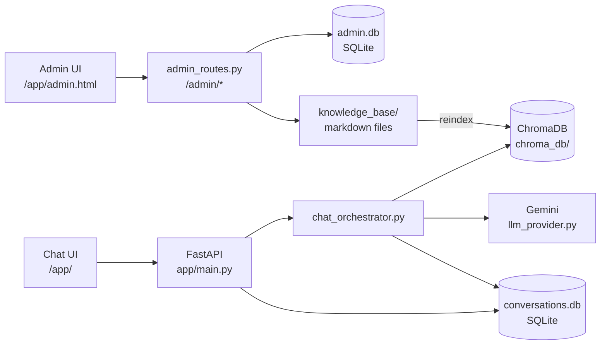
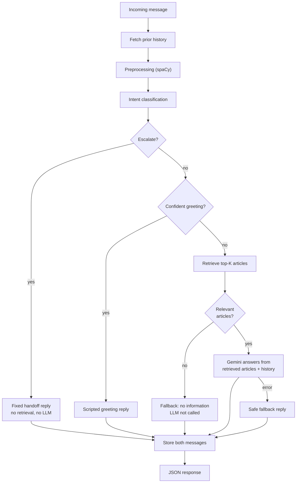

# SmartAssist — AI-Powered Customer Support Chatbot


A customer support chatbot that answers questions from a markdown knowledge
base using retrieval-augmented generation (RAG), keeps conversation history,
and hands off to a human when it should not keep answering on its own.

Built over 15 days as a **CODE-A-NOVA internship project**, following the
official project brief: NLP preprocessing → RAG retrieval → LLM response
generation → conversation memory → escalation logic, served through a web UI
with an admin panel.

> **Project status:** the full pipeline is implemented and covered by
> automated tests that use fakes and mocks. It has **not** yet been run
> against a real Gemini API, real embeddings, a real ChromaDB index, or a real
> browser, and it is **not** deployment-validated. See
> [Testing and evaluation](#testing-and-evaluation) and
> [Known limitations](#known-limitations).

---

## Table of contents

- [Overview](#overview)
- [Problem statement](#problem-statement)
- [Key features](#key-features)
- [Architecture](#architecture)
- [Knowledge base](#knowledge-base)
- [Technology stack](#technology-stack)
- [Project structure](#project-structure)
- [Getting started](#getting-started)
- [Usage](#usage)
- [Configuration](#configuration)
- [API reference](#api-reference)
- [Testing and evaluation](#testing-and-evaluation)
- [Security considerations](#security-considerations)
- [Known limitations](#known-limitations)
- [Future improvements](#future-improvements)
- [Contributing](#contributing)

---

## Overview

SmartAssist takes a customer message and runs it through a pipeline:

1. Classify the intent (greeting, FAQ, complaint, technical issue, escalation).
2. Decide whether the conversation should go to a human.
3. Otherwise, retrieve the most relevant knowledge base articles.
4. Ask an LLM (Google Gemini) to answer **only** from those articles.
5. Save both sides of the conversation in SQLite.

Customers use a browser chat interface and can rate each answer. Admins use a
separate, authenticated panel to manage knowledge base articles and review
conversation logs and feedback.

## Problem statement

Support teams answer the same questions repeatedly, while customers want
quick, accurate answers and a clear path to a person when the bot cannot
help. A useful support bot therefore needs to:

- ground answers in approved content instead of guessing,
- admit when it has no relevant information,
- remember earlier turns in a conversation,
- recognize when to stop and escalate to a human.

SmartAssist is a learning-scale implementation of that design.

## Key features

**Implemented**

- **RAG pipeline** — semantic search over 31 markdown FAQ articles using
  `all-MiniLM-L6-v2` embeddings and ChromaDB, with top-K retrieval and a
  relevance threshold.
- **LLM answer generation** — Gemini via a provider abstraction, with a
  system prompt that restricts answers to retrieved knowledge and treats
  retrieved text and user messages as data, not instructions.
- **Intent classification** — rules first, embedding similarity as fallback;
  five intents plus `unknown`.
- **Escalation logic** — explicit human requests, low intent confidence, and a
  transparent rule-based frustration heuristic (not a sentiment model).
- **Conversation memory** — SQLite sessions and messages with a sliding
  window for context.
- **Web chat UI** — plain HTML/CSS/JavaScript, typing indicator, session
  persistence across reloads, and thumbs up/down feedback per answer.
- **Admin panel** — token-protected KB article create/edit, index refresh,
  conversation logs, audit log, and feedback list.
- **Evaluation tooling** — reproducible intent, retrieval, escalation and
  feedback metrics that report "unavailable" instead of inventing numbers.
- **Safe degradation** — missing dependencies or a failed LLM call return a
  fallback reply rather than crashing the request.

**Not implemented**

- Docker containerization and deployment (the original brief's Day 15
  milestone).

## Architecture

### System components



### Chat workflow (`POST /chat`)



The pipeline lives in `app/chat_orchestrator.py`. The `/chat` route in
`app/main.py` is a thin wrapper around it.

### Design decisions

- **Escalation runs first and short-circuits.** An escalated message skips
  retrieval and the LLM and receives a fixed acknowledgment, so no AI answer
  is generated for a request being handed to a human.
- **Preprocessing is not fed downstream.** Intent routing and retrieval do
  their own normalization, and the router's rule phrases (such as "how do i")
  depend on stop words that preprocessing removes. Preprocessing still runs
  and reports `preprocessing_available`, but its output is otherwise unused.
- **History is fetched before the current message is stored**, so the
  escalation check does not double-count the message being evaluated.
- **Each external boundary degrades on its own.** spaCy, the embedding model,
  ChromaDB and Gemini each fall back through that module's existing defensive
  behavior; a failure does not crash the request.

### Intent and escalation rules

- **Intents:** `greeting`, `faq`, `complaint`, `technical_issue`,
  `escalation`, and `unknown`. Rules are checked in a fixed priority order
  (escalation → complaint → technical_issue → greeting → faq).
- **Confidence:** a rule match uses a fixed `0.95`. A semantic match uses the
  actual cosine similarity and is accepted only at `0.55` or above;
  otherwise the result is `unknown`.
- **Escalation triggers:** an explicit human request; intent confidence
  below `0.6`; frustration detected; or repeated failure across turns.
  Two signals together are reported as `multiple_escalation_signals`.
- **Frustration heuristic:** counts matched categories (negative language,
  failure language, urgency, repeated punctuation). At least two categories
  are needed to reach the `0.4` threshold, so a single keyword does not
  escalate. It cannot detect frustration that uses none of these signals,
  such as dry sarcasm.

## Knowledge base

- 31 markdown articles in `knowledge_base/`, organized into six categories:
  `account`, `billing`, `technical`, `shipping`, `returns`, `general`.
- Each article has frontmatter (`id`, `category`, `title`) and a body. The
  articles were generated once by `scripts/generate_kb.py`.
- `app/knowledge_base_loader.py` parses the files and skips unreadable ones
  instead of failing the whole load.
- `scripts/build_index.py` embeds the articles with `all-MiniLM-L6-v2` and
  stores them in ChromaDB (`chroma_db/`) with title, category, filename and
  path metadata, so answers can be traced to their source article.
- Retrieval returns the top K (default 3) results, each tagged
  `is_relevant` by comparing its distance to `RELEVANCE_DISTANCE_THRESHOLD`.
  That threshold is a starting guess and has not been tuned on real data.
- The LLM prompt includes at most 3 articles of up to 800 characters each.
- Admins can add or edit articles in the admin panel; the vector index is
  rebuilt after each change.

## Technology stack

| Area | Technology |
|---|---|
| Backend | Python, FastAPI, Uvicorn |
| NLP preprocessing | spaCy (`en_core_web_sm`) |
| Embeddings | sentence-transformers (`all-MiniLM-L6-v2`) |
| Vector store | ChromaDB (persistent, local) |
| LLM | Google Gemini (`gemini-1.5-flash`, behind a provider abstraction) |
| Storage | SQLite (`conversations.db`, `admin.db`) |
| Frontend | HTML, CSS, JavaScript (no framework, no build step) |
| Tests | Plain Python test modules, run with `python -m` |

## Project structure

```text
smartassist/
├── app/                      # backend application
│   ├── main.py               # FastAPI app and customer-facing routes
│   ├── chat_orchestrator.py  # end-to-end /chat pipeline
│   ├── preprocessing.py      # spaCy tokenization and lemmatization
│   ├── config.py             # central config and thresholds
│   ├── knowledge_base_loader.py
│   ├── embeddings.py         # all-MiniLM-L6-v2 wrapper
│   ├── vector_store.py       # ChromaDB indexing
│   ├── retrieval.py          # top-K search + relevance filtering
│   ├── llm_provider.py       # LLM abstraction + Gemini provider
│   ├── response_generator.py # prompt building + fallbacks
│   ├── intent_router.py      # rules + embedding-similarity intents
│   ├── escalation.py         # confidence and frustration escalation
│   ├── conversation_memory.py
│   ├── conversation_context.py
│   ├── feedback.py
│   ├── admin_store.py        # admin sessions + audit log
│   ├── admin_auth.py         # credential verification
│   ├── admin_dependencies.py # require_admin (Bearer token)
│   ├── admin_routes.py       # /admin/* routes
│   ├── admin_service.py      # KB edits + index refresh
│   ├── kb_admin.py           # safe article create/edit
│   ├── evaluation.py         # retrieval evaluation (sample queries)
│   ├── evaluation_data.py
│   ├── evaluation_metrics.py
│   ├── evaluation_runner.py
│   └── evaluation_report.py
├── frontend/                 # served by FastAPI at /app
│   ├── index.html
│   ├── style.css
│   ├── app.js
│   ├── admin.html
│   ├── admin.css
│   └── admin.js
├── knowledge_base/           # 31 articles in 6 category folders
│   ├── account/
│   ├── billing/
│   ├── technical/
│   ├── shipping/
│   ├── returns/
│   └── general/
├── scripts/
│   ├── generate_kb.py
│   ├── build_index.py
│   ├── evaluate_retrieval.py
│   ├── generate_admin_password_hash.py
│   └── run_evaluation.py
├── tests/                    # 20 test modules (listed below)
├── reports/                  # evaluation and testing reports
├── .env.example              # variable names only, no secrets
├── requirements.txt
├── .gitignore
└── README.md
```

Created automatically at runtime and gitignored: `conversations.db`,
`admin.db`, `chroma_db/`.

<details>
<summary>Test modules</summary>

```text
tests/
├── test_preprocessing.py
├── test_knowledge_base_loader.py
├── test_vector_store_logic.py
├── test_retrieval_logic.py
├── test_evaluation_logic.py
├── test_llm_provider.py
├── test_response_generator.py
├── test_intent_router.py
├── test_conversation_memory.py
├── test_escalation.py
├── test_frontend.py
├── test_admin.py
├── test_feedback.py
├── test_evaluation_metrics.py
├── test_response_generator_hardening.py
├── test_knowledge_base_edge_cases.py
├── test_retrieval_edge_cases.py
├── test_integration_flows.py
├── test_llm_provider_mocking.py
└── test_chat_orchestrator.py
```

</details>

## Getting started

### Prerequisites

- A recent Python 3 release (no version is pinned in the project docs)
- Internet access for the first run: the `all-MiniLM-L6-v2` model
  (about 80 MB) and the spaCy model are downloaded once
- A free Gemini API key from
  [Google AI Studio](https://aistudio.google.com/app/apikey) for real answers

### Install

Run these from the project root:

```bash
python -m venv venv
source venv/bin/activate        # Windows: venv\Scripts\activate
pip install -r requirements.txt
python -m spacy download en_core_web_sm
```

### Build the knowledge base index

```bash
python -m scripts.build_index
```

This creates `chroma_db/`. After editing articles by hand, rebuild with
`python -m scripts.build_index --force`.

### Configure

```bash
cp .env.example .env            # Windows: copy .env.example .env
```

Then edit `.env`. See [Configuration](#configuration) for each variable.
Never commit `.env`; it is already in `.gitignore`.

### Run

```bash
uvicorn app.main:app --reload
```

| URL | What it is |
|---|---|
| `http://127.0.0.1:8000/app/` | Customer chat UI |
| `http://127.0.0.1:8000/app/admin.html` | Admin panel |
| `http://127.0.0.1:8000/docs` | Interactive API docs |

## Usage

### Chat

Open the chat UI and send a message. The browser stores the session id in
`localStorage`, so the conversation survives a page reload. Each assistant
reply has thumbs up/down buttons.

### Admin panel

1. Generate a password hash and put it in `.env` as `ADMIN_PASSWORD_HASH`:

   ```bash
   python -m scripts.generate_admin_password_hash
   ```

2. Restart the server and sign in at `/app/admin.html`.
3. From the panel you can view, add and edit articles, refresh the RAG
   index, and review conversation logs, the audit log, and feedback.

### API example

```bash
curl -X POST http://127.0.0.1:8000/chat \
  -H "Content-Type: application/json" \
  -d '{"message": "How do I reset my password?"}'
```

Reuse the returned `session_id` in later requests to continue the same
conversation.

## Configuration

### Environment variables

| Variable | Required | Purpose |
|---|---|---|
| `GEMINI_API_KEY` | For LLM answers | Gemini API key. Without it the LLM call fails and the safe fallback reply is returned. |
| `ADMIN_USERNAME` | No | Admin login name. Defaults to `admin`. |
| `ADMIN_PASSWORD_HASH` | For admin access | SHA-256 hash of the admin password. If unset, admin login always fails. |

Use `.env.example` as the template. It lists variable names only.

### Tunable settings (`app/config.py`)

These are starting defaults, not values tuned on real usage.

| Setting | Default | Purpose |
|---|---|---|
| `RULE_MATCH_CONFIDENCE` | 0.95 | Confidence assigned to a rule-based intent match |
| `SEMANTIC_CONFIDENCE_THRESHOLD` | 0.55 | Minimum similarity to accept a semantic intent match |
| `INTENT_ESCALATION_THRESHOLD` | 0.6 | Intent confidence below this triggers escalation |
| `FRUSTRATION_SCORE_THRESHOLD` | 0.4 | Frustration score needed to escalate |
| `CONVERSATION_HISTORY_LIMIT` | 10 | Messages returned by the sliding window |
| `MAX_CONTEXT_ARTICLES` | 3 | Articles included in the LLM prompt |
| `MAX_CHARS_PER_ARTICLE` | 800 | Characters per article in the prompt |
| `MAX_FEEDBACK_COMMENT_CHARS` | 500 | Maximum feedback comment length |

`RELEVANCE_DISTANCE_THRESHOLD` (retrieval relevance cutoff),
`MAX_ARTICLE_TITLE_LENGTH` and `MAX_ARTICLE_CONTENT_CHARS` are also in
`app/config.py`. The prompt includes at most
`MAX_HISTORY_MESSAGES_IN_PROMPT` (6) prior messages.

## API reference

### Customer endpoints

| Method | Path | Description |
|---|---|---|
| GET | `/` | Status endpoint |
| POST | `/chat` | Send a message and get a reply |
| GET | `/history?session_id=...&limit=...` | Recent messages for a session |
| POST | `/feedback` | Rate an assistant reply |
| GET | `/app/` | Static frontend (chat UI and admin page) |

#### `POST /chat`

Request (`session_id` is optional; omit it to start a new conversation):

```json
{ "message": "How do I reset my password?", "session_id": "optional" }
```

Response shape (values are illustrative):

```json
{
  "reply": "...",
  "session_id": "...",
  "message_id": 42,
  "intent": "faq",
  "intent_confidence": 0.95,
  "escalated": false,
  "escalation_reason": null,
  "articles_used": ["account-002"],
  "used_llm": true
}
```

#### `GET /history`

Returns recent messages for the session, each with `id`, `role`, `content`
and `timestamp`. `limit` defaults to `CONVERSATION_HISTORY_LIMIT`. An unknown
`session_id` returns an empty list, not an error. The window limits what is
returned; it does not delete stored messages.

#### `POST /feedback`

```json
{ "session_id": "...", "message_id": 42, "rating": "helpful", "comment": "optional" }
```

`rating` must be `helpful` or `not_helpful`. The server checks that the
message exists, belongs to that session, and is an assistant message.
Re-rating the same message updates the existing row. A successful response
looks like `{ "status": "success", "feedback_id": 7, "updated": false }`.

### Admin endpoints

Every admin route except login requires `Authorization: Bearer <token>`.

| Method | Path | Description |
|---|---|---|
| POST | `/admin/login` | Exchange credentials for a session token |
| GET | `/admin/logs` | Audit log entries |
| GET | `/admin/feedback` | Raw feedback list |

`app/admin_routes.py` also defines the routes the panel uses to list, create
and edit articles and to refresh the index. Check that file or `/docs` for
their exact paths.

## Testing and evaluation

Automated tests and evaluation numbers below come from the project's own
reports, produced in a sandbox without spaCy, sentence-transformers,
ChromaDB, FastAPI, a browser, or Gemini credentials. They are **not**
real-world results.

### Automated tests

Each suite is a module run from the project root:

```bash
python -m tests.test_chat_orchestrator
python -m tests.test_escalation
python -m tests.test_conversation_memory
```

Older suites (Days 3–12) print an `ALL ... PASSED` summary but always exit
with code 0, so read the summary line instead of the exit code.
`test_evaluation_metrics` exits non-zero on failure.

| Result | Detail |
|---|---|
| 407 checks passed, 0 failed | Across 18 executable suites at the end of Day 14. `test_preprocessing` was skipped because spaCy was unavailable. |
| 48 checks (`test_chat_orchestrator`) | End-to-end pipeline integration, run directly against `handle_chat_message()`. The earlier suites were re-run and still passed. |
| 118 checks (`test_evaluation_metrics`) | Metric math against hand-computed values. 26 deliberately injected bugs were all detected (mutation testing). |

Testing also found and fixed four real bugs (details in
`reports/day14_testing_report.md`):

- an exception outside the expected LLM error types crashed response
  generation;
- an empty or non-string provider reply was passed through as valid;
- `generate_response(query, None)` raised `TypeError`;
- one corrupted file in `knowledge_base/` made the whole load return zero
  articles.

**What these tests do not prove**

- LLM tests use a fake provider, or a fake `google.generativeai` module
  injected through `sys.modules`. No real Gemini call has been made.
- Retrieval tests use fake embeddings and a fake vector store.
- FastAPI was not installed, so tests call the same functions the routes
  use rather than sending HTTP requests. Routing and request validation are
  untested.
- No real browser has loaded the frontend. Its JavaScript was syntax-checked
  with `node --check` and inspected with static checks.
- No test coverage percentage is reported.

### Evaluation

```bash
python -m scripts.build_index
python -m scripts.run_evaluation     # writes reports/evaluation_report.md and .json
```

The evaluation uses small hand-written datasets: 52 labeled intent
messages, 12 retrieval queries (scored by category), and 20 synthetic
escalation scenarios with fixed intent confidences. Anything that cannot be
measured is labeled `UNAVAILABLE` or `NO DATA` rather than shown as zero.

The report shipped in `reports/` is **incomplete** and was generated before
the Day 15 integration, so it describes components only:

| Component | Result | Status |
|---|---|---|
| Intent | 43/52 correct (82.7%), rule layer only. All 9 misses were `unknown`; when a rule fired it was correct 43/43 times. | Partial: embedding fallback unavailable |
| Retrieval | No numbers | Unavailable: ChromaDB and embeddings not installed |
| Escalation | 17/20 correct decisions, 0 false escalations, 3 missed | Measured on synthetic scenarios |
| Feedback | No numbers | No data |

The 3 missed escalations were hard cases: a paraphrase not in the phrase
list ("Is there a live person I can chat with?") and two messages with
implicit frustration and no keyword signals. Regenerate the report on a
machine with all dependencies installed before citing these numbers.

End-to-end answer quality, hallucination rate and latency (the brief's target
is under 5 seconds for 90% of queries) have **not** been measured.

## Security considerations

- **SQL:** all queries are parameterized. Roles are validated against an
  allow-list, and empty messages are rejected.
- **Secrets:** the Gemini key and admin hash live only in `.env`, which is
  gitignored. Neither appears in the frontend code, and the audit log stores
  only action names, article ids and status strings.
- **Admin access:** login credentials come from environment variables, and
  login fails closed if no hash is configured. Sessions are random tokens
  stored server-side in `admin.db`, checked by `require_admin` on every admin
  route.
- **Path traversal:** KB categories and filenames must match
  `^[a-z0-9][a-z0-9-]*$`, and each resolved path is re-checked with
  `os.path.realpath()` to confirm it stays inside `knowledge_base/`.
- **Input limits:** article title and content, and feedback comments, have
  length limits.
- **Frontend:** message content is rendered with `textContent`, not
  `innerHTML`. Admin tokens use `sessionStorage`; the customer session id uses
  `localStorage`.
- **Feedback integrity:** message and session ownership are verified
  server-side on every submission.
- **Prompt injection:** the system prompt tells the model to treat retrieved
  articles, history and user messages as data, and the prompt separates them
  with delimiters. This is a mitigation tested only with fakes; it has not
  been verified against a real model.

Known gaps are listed under [Known limitations](#known-limitations).

## Known limitations

- Never exercised against a real Gemini API, real embeddings, or a real
  ChromaDB index; only fakes and mocks. Set a real `GEMINI_API_KEY`, run
  `scripts/build_index.py`, and test real conversations before treating the
  system as validated.
- No real browser testing, and no live-server HTTP test.
- Docker and deployment are not done. The project is not production-ready.
- Preprocessing output is not used by intent routing or retrieval.
- `preprocessing_available` is `False` wherever spaCy is not installed.
- Thresholds (`RELEVANCE_DISTANCE_THRESHOLD`, `SEMANTIC_CONFIDENCE_THRESHOLD`,
  `INTENT_ESCALATION_THRESHOLD`, `FRUSTRATION_SCORE_THRESHOLD`) are untuned
  starting values.
- Keyword and phrase lists for intents and frustration are starter sets.
  Paraphrased human requests and implicit frustration can be missed.
- The router can label a message `escalation`, but the escalation check only
  uses its own phrase list and ignores that label.
- The admin password is stored as a SHA-256 hash, a general-purpose hash
  rather than a dedicated password-hashing algorithm.
- The semantic intent fallback re-embeds all example phrases on every call,
  and LLM responses are not cached. Both observations come from code review
  and are not measured.
- Evaluation datasets are small and hand-written, and the shipped report is
  partial.
- Conversation history stays in `conversations.db` until the file is deleted.
- The `gemini-1.5-flash` model name has not been checked against the live
  API; confirm it is still available when you add a key.

## Future improvements

- Add Docker containerization and deployment (the original brief's Day 15).
- Run the full evaluation locally and regenerate the report; use it to tune
  thresholds, and only after that adjust rules.
- Treat an `escalation` intent at sufficient confidence as an explicit
  request (candidate fix; changes escalation behavior, so verify first).
- Re-measure and carefully extend the frustration heuristic for implicit
  signals, watching for false escalations.
- Cache the semantic example embeddings and LLM responses, then measure
  latency against the brief's target.
- Evaluate the integrated pipeline end to end, including answer quality and
  hallucination avoidance.
- Review "not helpful" feedback to find knowledge base gaps once real users
  rate responses.
- Consider a dedicated password-hashing algorithm for admin credentials
  (suggestion, not part of the original roadmap).

## Contributing

Contributions and suggestions are welcome.

1. Fork the repository and create a feature branch.
2. Keep changes focused, and add or update tests under `tests/`.
3. Run the relevant suites with `python -m tests.<module_name>`, plus the
   suites for any module you touched.
4. State clearly in your pull request whether a test used real services or
   fakes.
5. Never commit `.env`, API keys, password hashes, or the runtime databases.
6. Keep documentation accurate: do not describe planned work as implemented.
