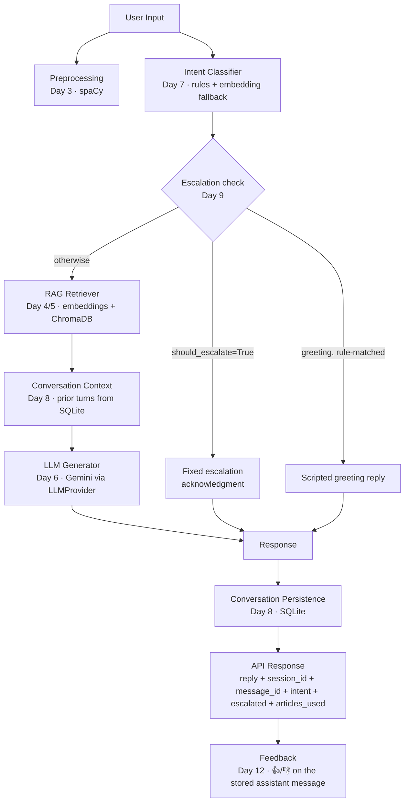

# SmartAssist — Architecture & Data Flow

This diagram reflects the **actual final implementation** as of Day 15
— i.e. what `app/chat_orchestrator.py` really calls, in the real order,
not an aspirational version. Where a component exists in code but isn't
actually exercised in this sandbox (no internet access here), that's
noted explicitly rather than implied.

## Request flow (`POST /chat`)

Note on **B (Preprocessing)**: it runs, but its cleaned/lemmatized output
is deliberately **not** fed into C or G — both already do their own text
normalization suited to their specific needs (see `app/chat_orchestrator.py`'s
module docstring, design decision 3, for exactly why feeding
stopword-stripped text into the intent router's rule matching would
break it). Preprocessing's role here is honoring the documented pipeline
stage and reporting whether it succeeded (`preprocessing_available`).

## Supporting components

| Component | Status in the final code | Status in THIS sandbox |
|---|---|---|
| FastAPI backend | **Active** — all routes (`/`, `/chat`, `/history`, `/feedback`, `/admin/*`) are real and wired | FastAPI itself is not installed here (no internet) — never actually run as a server in this sandbox |
| Markdown knowledge base | **Active** — 31 real articles, loaded by `app/knowledge_base_loader.py` | Fully functional here — no external dependency needed |
| Preprocessing (spaCy) | **Active** in the pipeline (see note above) | Not installable here — `preprocessing_available` reports `False` honestly rather than faking success |
| sentence-transformers (embeddings) | **Active** — `app/embeddings.py`, model `all-MiniLM-L6-v2` | Not installed here — every retrieval test uses a fake embedder |
| ChromaDB (vector store) | **Active** — `app/vector_store.py`, persisted to `chroma_db/` | Not installed here — every retrieval test uses a fake collection |
| LLM provider (Gemini) | **Active** — `app/llm_provider.py`, `app/response_generator.py` | No real API key/network here — every LLM test uses a fake/mocked provider (including SDK-level mocking, Day 14) |
| SQLite (conversation memory) | **Active** — `app/conversation_memory.py`, two tables (`sessions`, `messages`) plus `feedback` | Fully functional here — sqlite3 is Python's standard library, no external dependency |
| SQLite (admin) | **Active** — `app/admin_store.py`, separate `admin.db` (sessions + audit log) | Fully functional here |
| Escalation logic | **Active** — `app/escalation.py`, deterministic keyword/pattern heuristic | Fully functional here — no external dependency |
| Web frontend | **Active** — `frontend/index.html` + `app.js`, served by FastAPI's `StaticFiles` at `/app/` | Never loaded in a real browser in this sandbox (none available) |
| Admin panel | **Active** — `frontend/admin.html` + `admin.js`, protected `/admin/*` routes | Never loaded in a real browser; backend logic is tested directly |
| Feedback system | **Active** — `app/feedback.py`, linked to a specific assistant `message_id` | Fully functional here |
| Docker | Files exist (`Dockerfile`, `docker-compose.yml`) | **Not built or run** — Docker isn't installed in this sandbox (see `reports/day15_docker_notes.md`) |

## What's genuinely verified vs. what needs a real environment

Everything marked "Active" in the code column has **automated tests**
behind it (see `reports/day14_testing_report.md` for the full breakdown
— 459 checks across 19 suites as of Day 15). What those tests prove is
that each component's own logic is correct, and that they call each
other correctly — not that the real external services (Gemini,
ChromaDB, sentence-transformers, spaCy) behave identically. That
distinction is the entire reason this file, `reports/day15_docker_notes.md`,
and `docs/deployment.md` exist as separate, honest documents rather than
one document claiming blanket success.
